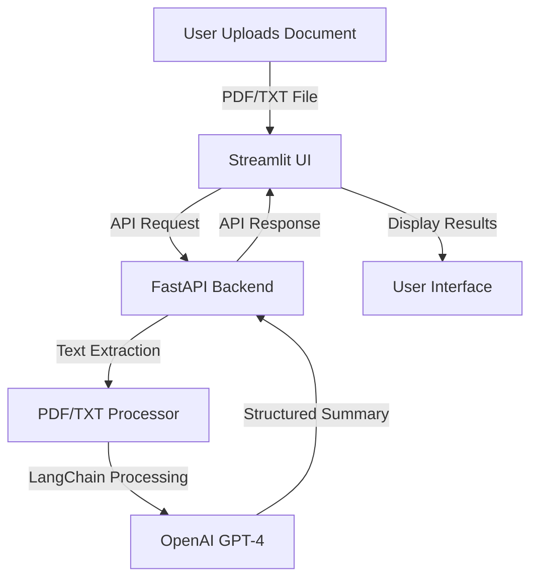

# LegalAI: Contract Clause Extractor ⚖️

[](https://python.org)  
[](https://fastapi.tiangolo.com)  
[](https://streamlit.io)  
[](https://openai.com)  

An AI-powered legal document analysis system that automatically extracts key clauses and simplifies legal jargon using **OpenAI GPT-4** and **LangChain**.


---

## 🧠 Powered by OpenAI GPT-4

This project leverages **OpenAI's GPT-4** model for:
- **Natural Language Understanding**: Accurately identifies legal clauses in complex documents.
- **Summarization**: Condenses lengthy legal text into concise, structured summaries.
- **Language Transformation**: Simplifies technical legal jargon into plain language for non-experts.

### Why OpenAI GPT-4?
- **State-of-the-art language model**: Provides superior accuracy in legal text analysis.
- **Contextual understanding**: Maintains context across long documents.
- **Customizable prompts**: Tailored for legal compliance and clause extraction.

---

## 📌 Overview

A dual-component application featuring:
- **Backend**: FastAPI server with LangChain/OpenAI integration
- **Frontend**: Streamlit web interface for document processing
- **AI Features**: Clause extraction, technical simplification, PDF/TXT support
  
---

## 🗂️ Project Structure

```sh
legal-ai-summarizer/
├── backend/
│   ├── main.py          # FastAPI server & AI processing
├── frontend/
│   ├── app.py           # Streamlit UI
├── requirements.txt     # Dependency list
├── .env                 # API configuration
├── README.md            # Project documentation
└── sample_contract.pdf  # Example test document
```

---

## ✨ Features

- 📄 PDF/TXT document processing
- 🔍 Key clause extraction (6 legal categories)
- 🗣️ Technical jargon simplification
- ⚡ Real-time processing feedback
- 🛡️ Secure temp file handling
- 🚦 Comprehensive error handling
- 🔄 API-driven architecture

---

## 🔄 Workflow Diagram



---

## 🛠️ Installation

```bash
# Clone repository
git clone https://github.com/haseebahmed49/langchain-legalDoc-summarize.git
cd langchain-legalDoc-summarize

# Create virtual environment
python3 -m venv venv
source venv/bin/activate  # Linux/Mac
venv\Scripts\activate     # Windows

# Install dependencies
pip install -r requirements.txt
```

---

## ⚙️ Configuration

Create `.env` file:
```env
OPENAI_API_KEY=your_api_key_here
```

---

## 🚀 Usage

### Start Backend Server
```bash
uvicorn backend.main:app --reload
```

### Launch Frontend Interface
```bash
streamlit run frontend/app.py
```

Access the web interface at `http://localhost:8501`

---

## 🔧 API Endpoints

| Endpoint | Method | Description |
|----------|--------|-------------|
| `/extract` | POST | Process legal documents (file upload) |

**Parameters:**
- `file`: PDF/TXT document
- `transform`: boolean (enable jargon simplification)

**Response:**
```json
{
  "summary": "Markdown formatted clauses",
  "transformed_summary": "Simplified explanations"
}
```

---

## 🌟 Example Usage

```python
import requests

with open("contract.pdf", "rb") as f:
    response = requests.post(
        "http://localhost:8000/extract",
        files={"file": f},
        params={"transform": True}
    )

print(response.json())
```

**Sample Response:**
```json
{
  "summary": "- **Confidentiality**: All parties must maintain...",
  "transformed_summary": "**Privacy Requirements**: Everyone involved must keep..."
}
```

---

## 🧪 Testing

1. **API Testing** (using curl):
```bash
curl -X POST -F "file=@sample_contract.pdf" http://localhost:8000/extract
```

2. **Frontend Testing**:
- Access Streamlit interface
- Upload sample document
- Click "Extract Legal Clauses"

---

## 📈 Future Enhancements

- [ ] Multi-document comparison
- [ ] Clause violation detection
- [ ] Version control for documents
- [ ] User authentication
- [ ] Export to Word/PDF
- [ ] Audit trail logging

---

## 🤝 Contributing

1. Fork the repository  
2. Create feature branch (`git checkout -b feature/NewFeature`)  
3. Commit changes (`git commit -am 'Add NewFeature'`)  
4. Push to branch (`git push origin feature/NewFeature`)  
5. Open Pull Request

---

## 📜 License

Distributed under the MIT License. See `LICENSE` for details.

---

## 📧 Contact

**Project Maintainer**: [Haseeb Ahmed] - haseebahmed02@gmail.com  
**GitHub Repository**: [https://github.com/haseebahmed49/langchain-legalDoc-summarize](https://github.com/haseebahmed49/langchain-legalDoc-summarize)

---
